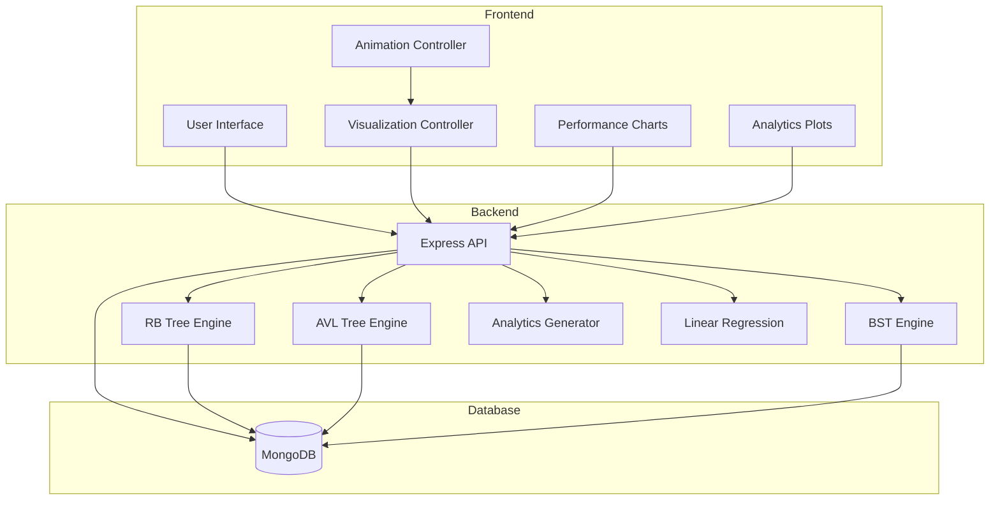

# Design Document: Red-Black Tree Visualizer

## Overview

The Red-Black Tree Visualizer is a full-stack web application that provides interactive visualization, performance analysis, and automated experimentation for Red-Black Tree data structures. The system architecture follows a client-server model where the backend handles all tree logic and computations, while the frontend focuses on rendering and user interaction.

The application consists of three primary modes:
1. **Visualization Mode**: Interactive tree operations with step-by-step animated balancing
2. **Performance Mode**: Side-by-side comparison of RB Trees, AVL Trees, and BSTs
3. **AI Analytics Mode**: Automated experiments with pattern generation and regression analysis

Key design principles:
- Backend owns all tree logic and state
- Frontend is a pure rendering layer consuming JSON APIs
- All tree operations return structured step sequences for animation
- MongoDB provides persistence for operation logs and historical analysis
- Manual linear regression implementation (no external ML libraries)

## Architecture

### System Architecture



### Component Interaction Flow

**Visualization Mode Flow**:
1. User enters operation (insert/delete/search) in UI
2. Frontend sends POST request to Backend_API
3. Backend_API executes operation on RB_Tree
4. RB_Tree computes balancing steps and returns structured JSON array
5. Backend_API stores operation log in MongoDB
6. Frontend receives step array and passes to Animation_Controller
7. Animation_Controller renders each step with D3.js transitions
8. Operation_History_Panel updates with human-readable log entries

**Performance Mode Flow**:
1. User enters insertion sequence in Performance Mode UI
2. Frontend sends POST /performance request with sequence
3. Backend_API creates three tree instances (RB, AVL, BST)
4. Backend_API applies sequence to all three trees, collecting metrics
5. Backend_API returns comparison data: heights, rotations, times, recolors
6. Frontend renders table and graph visualizations
7. Frontend renders side-by-side tree structures if requested

**Analytics Mode Flow**:
1. User selects pattern type and experiment parameters
2. Frontend sends request to Analytics_Engine
3. Pattern_Generator creates insertion sequences
4. Analytics_Engine runs experiments on RB_Tree, collecting height data
5. Linear_Regression computes trend line manually
6. Backend_API returns plot data with actual vs theoretical curves
7. Frontend renders plots with D3.js

## Components and Interfaces

### Backend Components

#### 1. Tree Implementations

**RBTree Class**:
```javascript
class RBTree {
  constructor()
  insert(value) -> { tree, steps, metrics }
  delete(value) -> { tree, steps, metrics }
  search(value) -> { found, path }
  getHeight() -> number
  getBlackHeight() -> number
  toJSON() -> object
  validateInvariants() -> boolean
}
```

**AVLTree Class**:
```javascript
class AVLTree {
  constructor()
  insert(value) -> { tree, steps, metrics }
  delete(value) -> { tree, steps, metrics }
  search(value) -> { found, path }
  getHeight() -> number
  getBalanceFactor(node) -> number
  toJSON() -> object
}
```

**BST Class**:
```javascript
class BST {
  constructor()
  insert(value) -> { tree, steps, metrics }
  delete(value) -> { tree, steps, metrics }
  search(value) -> { found, path }
  getHeight() -> number
  toJSON() -> object
}
```

#### 2. API Routes

**POST /api/insert**:
- Request: `{ treeType: "RB" | "AVL" | "BST", value: number }`
- Response: `{ success: boolean, tree: object, steps: array, metrics: object, error?: string }`

**POST /api/delete**:
- Request: `{ treeType: "RB" | "AVL" | "BST", value: number }`
- Response: `{ success: boolean, tree: object, steps: array, metrics: object, error?: string }`

**GET /api/tree/:treeType**:
- Response: `{ tree: object, metrics: object }`

**POST /api/performance**:
- Request: `{ sequence: number[] }`
- Response: `{ rb: metrics, avl: metrics, bst: metrics }`

**GET /api/history**:
- Query params: `treeType`, `startDate`, `endDate`
- Response: `{ logs: array }`

**POST /api/export**:
- Request: `{ treeType: string }`
- Response: `{ operations: array, metadata: object }`

**POST /api/import**:
- Request: `{ operations: array, treeType: string }`
- Response: `{ success: boolean, tree: object, error?: string }`

**POST /api/analytics/experiment**:
- Request: `{ pattern: "random" | "sorted" | "reverse" | "alternating", trials: number, maxNodes: number }`
- Response: `{ data: array, regression: object, theoretical: array }`

#### 3. Analytics Engine

**PatternGenerator**:
```javascript
class PatternGenerator {
  generateRandom(count) -> number[]
  generateSorted(count) -> number[]
  generateReverseSorted(count) -> number[]
  generateAlternating(count) -> number[]
}
```

**LinearRegression**:
```javascript
class LinearRegression {
  fit(xValues, yValues) -> { slope, intercept, rSquared }
  predict(x) -> y
  computeRSquared(actual, predicted) -> number
}
```

**ExperimentRunner**:
```javascript
class ExperimentRunner {
  runExperiment(pattern, trials, maxNodes) -> { dataPoints, regression }
  collectMetrics(tree, operations) -> { heights, rotations, recolors }
}
```

### Frontend Components

#### 1. Visualization Engine

**TreeRenderer (D3.js)**:
```javascript
class TreeRenderer {
  constructor(svgElement)
  renderTree(treeData) -> void
  animateStep(step) -> Promise<void>
  highlightNodes(nodeIds, color) -> void
  updateMetrics(metrics) -> void
  clear() -> void
}
```

**AnimationController**:
```javascript
class AnimationController {
  constructor(renderer, steps)
  play() -> void
  pause() -> void
  nextStep() -> void
  previousStep() -> void
  setMode(mode) -> void // "auto" | "manual"
  getCurrentStep() -> number
}
```

#### 2. UI Controllers

**VisualizationModeController**:
```javascript
class VisualizationModeController {
  handleInsert(value) -> void
  handleDelete(value) -> void
  handleSearch(value) -> void
  updateHistoryPanel(entry) -> void
  displayError(message) -> void
}
```

**PerformanceModeController**:
```javascript
class PerformanceModeController {
  handleSequenceSubmit(sequence) -> void
  renderComparisonTable(data) -> void
  renderComparisonGraph(data) -> void
  renderSideBySide(trees) -> void
}
```

**AnalyticsModeController**:
```javascript
class AnalyticsModeController {
  handlePatternSelect(pattern) -> void
  handleExperimentRun(params) -> void
  renderPlots(data) -> void
  displayRegression(stats) -> void
}
```

## Data Models

### Tree Node Structure

**RBNode**:
```javascript
{
  value: number,
  color: "RED" | "BLACK",
  left: RBNode | null,
  right: RBNode | null,
  parent: RBNode | null
}
```

**AVLNode**:
```javascript
{
  value: number,
  height: number,
  left: AVLNode | null,
  right: AVLNode | null
}
```

**BSTNode**:
```javascript
{
  value: number,
  left: BSTNode | null,
  right: BSTNode | null
}
```

### Balancing Step Structure

```javascript
{
  stepType: "insert" | "rotate_left" | "rotate_right" | "recolor" | "case_trigger",
  description: string,
  affectedNodes: number[],
  caseType?: "case1" | "case2" | "case3",
  beforeState: object,
  afterState: object,
  metrics: {
    rotations: number,
    recolors: number,
    height: number,
    blackHeight: number
  }
}
```

### Operation Log Schema (MongoDB)

```javascript
{
  _id: ObjectId,
  treeType: "RB" | "AVL" | "BST",
  operation: "insert" | "delete" | "search",
  value: number,
  rotations: number,
  recolors: number,
  heightAfterOperation: number,
  timestamp: Date,
  executionTime: number
}
```

**Indexes**:
- `{ treeType: 1, timestamp: -1 }`
- `{ timestamp: -1 }`

### Export/Import Format

```javascript
{
  version: "1.0",
  treeType: "RB" | "AVL" | "BST",
  operations: [
    { type: "insert", value: number },
    { type: "delete", value: number }
  ],
  metadata: {
    exportDate: Date,
    totalOperations: number,
    finalHeight: number
  }
}
```

### Performance Comparison Data

```javascript
{
  rb: {
    height: number,
    rotations: number,
    recolors: number,
    executionTime: number,
    tree: object
  },
  avl: {
    height: number,
    rotations: number,
    executionTime: number,
    tree: object
  },
  bst: {
    height: number,
    executionTime: number,
    tree: object
  }
}
```

### Analytics Experiment Data

```javascript
{
  pattern: "random" | "sorted" | "reverse" | "alternating",
  trials: number,
  dataPoints: [
    { nodes: number, height: number, rotations: number, recolors: number }
  ],
  regression: {
    slope: number,
    intercept: number,
    rSquared: number
  },
  theoretical: [
    { nodes: number, height: number } // O(log n) curve
  ]
}
```

## User Experience Flows

### Visualization Mode (Tab 1) - Detailed Flow

**Auto-Play Mode (Default)**:
1. User enters value in input field
2. User clicks "Insert" button
3. Frontend sends POST /api/insert request
4. Backend processes operation and returns step array
5. Animation starts automatically
6. Each step plays with 500ms delay
7. Operation History Panel updates in real-time
8. Final state displayed with updated metrics

**Manual Step Mode**:
1. User toggles "Manual Mode" switch
2. User performs insert/delete operation
3. Animation pauses at first step
4. User controls playback:
   - "Next Step" → Advance one step
   - "Previous Step" → Go back one step
   - "Play" → Resume auto-play
   - "Pause" → Stop at current step
5. Step counter shows: "Step 3 of 7"
6. Current step description displayed prominently

**Case Highlighting**:
- When Case 1 triggered: Uncle and parent nodes highlighted in yellow
- When Case 2 triggered: Triangle configuration highlighted with rotation arrow
- When Case 3 triggered: Line configuration highlighted with rotation + recolor indicators
- Case name displayed in banner: "Case 1: Uncle is Red - Recoloring"

### Performance Mode (Tab 2) - Detailed Flow

**Option A: User-Defined Sequence (Primary)**:
1. User enters comma-separated values: "10, 20, 30, 15, 5"
2. User clicks "Compare Trees"
3. Frontend sends POST /api/performance with sequence
4. Backend creates three tree instances (RB, AVL, BST)
5. Backend applies same sequence to all three
6. Backend collects metrics for each tree
7. Frontend displays:
   - Comparison table with metrics
   - Height vs Nodes graph (line chart)
   - Side-by-side tree visualizations
8. Differences highlighted (e.g., BST height in red if significantly higher)

**Option B: Random Sequence Generation (Secondary)**:
1. User clicks "Generate Random Sequence"
2. User specifies node count (e.g., 100)
3. Backend generates random sequence
4. Same comparison flow as Option A
5. Generated sequence displayed for reference

**Side-by-Side View**:
```
┌─────────────┬─────────────┬─────────────┐
│   RB Tree   │  AVL Tree   │     BST     │
│  Height: 4  │  Height: 4  │  Height: 5  │
│  Rots: 2    │  Rots: 3    │  Rots: 0    │
│  [Tree]     │  [Tree]     │  [Tree]     │
└─────────────┴─────────────┴─────────────┘
```

### Analytics Mode (Tab 3) - Detailed Flow

**Experiment Setup**:
1. User selects pattern type from dropdown:
   - Random
   - Sorted (Ascending)
   - Reverse Sorted (Descending)
   - Alternating High-Low
2. User sets parameters:
   - Number of trials: 10
   - Max nodes per trial: 500
3. User clicks "Run Experiment"

**Experiment Execution**:
1. Frontend sends POST /api/analytics/experiment
2. Backend Pattern_Generator creates sequences
3. For each trial:
   - Create fresh RB_Tree
   - Insert nodes from pattern
   - Collect metrics at intervals (every 10 nodes)
4. Backend computes linear regression manually
5. Backend generates theoretical O(log n) curve
6. Backend returns plot data

**Results Display**:
1. Plot 1: Nodes vs Height
   - Actual data points (scatter)
   - Regression line (solid)
   - Theoretical O(log n) curve (dashed)
2. Plot 2: Nodes vs Rotations
3. Plot 3: Nodes vs Recolors
4. Statistics panel:
   - Regression equation: y = 1.44x + 2.1
   - R² value: 0.987
   - Pattern type: Random
   - Trials completed: 10

## Animation Specifications

### Rotation Animation Details

**Left Rotation**:
```
Before:        During:         After:
   x              x→y             y
    \              ↓             /
     y     →      x y    →      x
    /              ↓              \
   a               a               a
```

Animation sequence:
1. Highlight pivot node (x) and rotating node (y) - 200ms
2. Fade out old edges - 300ms
3. Move nodes to new positions - 500ms
4. Fade in new edges - 300ms
5. Update node positions in tree - 100ms

**Right Rotation**: Mirror of left rotation

### Recolor Animation

1. Node border pulses - 200ms
2. Color transitions smoothly - 400ms
3. Node settles - 200ms
4. Total duration: 800ms

### Node Insertion Animation

1. New node appears at insertion point (faded) - 200ms
2. Node fades in fully - 300ms
3. Edges connect to parent - 200ms
4. Balancing animations begin (if needed)

## Error Handling

### Frontend Error Display

**Duplicate Value Error**:
```
┌─────────────────────────────────────┐
│ ⚠ Error: Value 25 already exists   │
│   in the tree. Duplicates not      │
│   allowed.                          │
└─────────────────────────────────────┘
```

**Size Limit Error**:
```
┌─────────────────────────────────────┐
│ ⚠ Error: Tree size limit reached   │
│   (1000 nodes). Cannot insert more. │
└─────────────────────────────────────┘
```

**Invalid Input Error**:
```
┌─────────────────────────────────────┐
│ ⚠ Error: Please enter a valid      │
│   integer value.                    │
└─────────────────────────────────────┘
```

### Backend Error Responses

**Standard Error Format**:
```javascript
{
  success: false,
  error: {
    code: "DUPLICATE_VALUE" | "SIZE_LIMIT" | "INVALID_INPUT" | "NOT_FOUND",
    message: "Human-readable error message",
    details: {} // Optional additional context
  }
}
```

**Error Codes**:
- `DUPLICATE_VALUE`: Attempted to insert existing value
- `SIZE_LIMIT`: Tree exceeds 1000 nodes
- `INVALID_INPUT`: Non-integer or out-of-range value
- `NOT_FOUND`: Delete/search on non-existent value
- `INVALID_TREE_TYPE`: Unknown tree type specified
- `IMPORT_VALIDATION_FAILED`: Invalid JSON format in import
- `DATABASE_ERROR`: MongoDB operation failed

## UI Component Specifications

### Tab Navigation Bar

```
┌────────────────────────────────────────────────────┐
│ [Visualization] [Performance] [AI Analysis]        │
└────────────────────────────────────────────────────┘
```

Active tab: Highlighted with bottom border and brighter text
Inactive tabs: Dimmed, clickable

### Visualization Mode Layout

```
┌──────────────────────────────────────────────────────┐
│  Input: [____] [Insert] [Delete] [Search]            │
│  Mode: [Auto-Play ▼] [Manual Mode Toggle]            │
├──────────────────────────────────────────────────────┤
│                                                       │
│                   Tree Visualization                  │
│                      (D3.js SVG)                      │
│                                                       │
│  Metrics: Height: 5 | Black-Height: 3 | Rotations: 2 │
├──────────────────────────────────────────────────────┤
│  Controls: [⏮ Prev] [⏸ Pause] [⏭ Next] [▶ Play]    │
│  Step: 3 of 7 - "Rotate Left at Node 20"             │
├──────────────────────────────────────────────────────┤
│  Operation History:                                   │
│  • Insert 20                                          │
│  • Insert 15                                          │
│  • Case 1: Uncle Red - Recolor                       │
│  • Rotate Left at 10                                  │
└──────────────────────────────────────────────────────┘
```

### Performance Mode Layout

```
┌──────────────────────────────────────────────────────┐
│  Sequence: [10, 20, 30, 15, 5] [Compare]             │
│  Or: [Generate Random] Nodes: [100]                  │
├──────────────────────────────────────────────────────┤
│  Comparison Table:                                    │
│  ┌────────┬────────┬──────────┬──────────┬─────────┐ │
│  │ Tree   │ Height │ Rotations│ Recolors │ Time(ms)│ │
│  ├────────┼────────┼──────────┼──────────┼─────────┤ │
│  │ RB     │   4    │    2     │    3     │   12    │ │
│  │ AVL    │   4    │    3     │    -     │   15    │ │
│  │ BST    │   5    │    0     │    -     │    8    │ │
│  └────────┴────────┴──────────┴──────────┴─────────┘ │
├──────────────────────────────────────────────────────┤
│  Height vs Nodes Graph:                               │
│  [Line chart with three lines]                        │
├──────────────────────────────────────────────────────┤
│  Side-by-Side View: [Show Trees]                     │
│  [RB Tree]    [AVL Tree]    [BST]                    │
└──────────────────────────────────────────────────────┘
```

### Analytics Mode Layout

```
┌──────────────────────────────────────────────────────┐
│  Pattern: [Random ▼] Trials: [10] Max Nodes: [500]  │
│  [Run Experiment] [Export Results]                   │
├──────────────────────────────────────────────────────┤
│  Plot 1: Nodes vs Height                              │
│  [Scatter plot + Regression line + O(log n) curve]   │
├──────────────────────────────────────────────────────┤
│  Plot 2: Nodes vs Rotations                           │
│  [Line chart]                                         │
├──────────────────────────────────────────────────────┤
│  Statistics:                                          │
│  • Regression: y = 1.44x + 2.1                       │
│  • R² = 0.987                                         │
│  • Pattern: Random                                    │
│  • Trials: 10                                         │
└──────────────────────────────────────────────────────┘
```

## Implementation Details

### Red-Black Tree Balancing Cases

**Case 1: Uncle is Red**
```javascript
// Pseudocode
if (uncle && uncle.color === RED) {
  parent.color = BLACK;
  uncle.color = BLACK;
  grandparent.color = RED;
  node = grandparent; // Continue fixing from grandparent
  
  // Step structure returned:
  {
    stepType: "case_trigger",
    caseType: "case1",
    description: "Case 1: Uncle is Red - Recoloring parent, uncle, and grandparent",
    affectedNodes: [parent.value, uncle.value, grandparent.value],
    beforeState: { /* tree snapshot */ },
    afterState: { /* tree snapshot */ }
  }
}
```

**Case 2: Uncle is Black, Triangle Configuration**
```javascript
// Node is right child of left parent (or left child of right parent)
if (node === parent.right && parent === grandparent.left) {
  rotateLeft(parent);
  node = parent; // Now in Case 3 configuration
  
  // Step structure:
  {
    stepType: "case_trigger",
    caseType: "case2",
    description: "Case 2: Triangle - Rotate to convert to Case 3",
    affectedNodes: [node.value, parent.value],
    beforeState: { /* tree snapshot */ },
    afterState: { /* tree snapshot */ }
  }
}
```

**Case 3: Uncle is Black, Line Configuration**
```javascript
// Node is left child of left parent (or right child of right parent)
parent.color = BLACK;
grandparent.color = RED;
rotateRight(grandparent);

// Step structure:
{
  stepType: "case_trigger",
  caseType: "case3",
  description: "Case 3: Line - Rotate and recolor",
  affectedNodes: [parent.value, grandparent.value],
  beforeState: { /* tree snapshot */ },
  afterState: { /* tree snapshot */ }
}
```

### Linear Regression Implementation

**Manual JavaScript Implementation** (No external libraries):

```javascript
class LinearRegression {
  constructor() {
    this.slope = 0;
    this.intercept = 0;
    this.rSquared = 0;
  }
  
  fit(xValues, yValues) {
    const n = xValues.length;
    
    // Calculate means
    const xMean = xValues.reduce((a, b) => a + b, 0) / n;
    const yMean = yValues.reduce((a, b) => a + b, 0) / n;
    
    // Calculate slope: Σ((x - x̄)(y - ȳ)) / Σ((x - x̄)²)
    let numerator = 0;
    let denominator = 0;
    
    for (let i = 0; i < n; i++) {
      const xDiff = xValues[i] - xMean;
      const yDiff = yValues[i] - yMean;
      numerator += xDiff * yDiff;
      denominator += xDiff * xDiff;
    }
    
    this.slope = numerator / denominator;
    this.intercept = yMean - this.slope * xMean;
    
    // Calculate R²
    this.rSquared = this.computeRSquared(xValues, yValues);
    
    return {
      slope: this.slope,
      intercept: this.intercept,
      rSquared: this.rSquared
    };
  }
  
  predict(x) {
    return this.slope * x + this.intercept;
  }
  
  computeRSquared(xValues, yValues) {
    const yMean = yValues.reduce((a, b) => a + b, 0) / yValues.length;
    
    let ssTotal = 0; // Total sum of squares
    let ssResidual = 0; // Residual sum of squares
    
    for (let i = 0; i < xValues.length; i++) {
      const predicted = this.predict(xValues[i]);
      ssTotal += Math.pow(yValues[i] - yMean, 2);
      ssResidual += Math.pow(yValues[i] - predicted, 2);
    }
    
    return 1 - (ssResidual / ssTotal);
  }
}
```

### Pattern Generators

**Random Pattern**:
```javascript
generateRandom(count) {
  const values = [];
  const used = new Set();
  
  while (values.length < count) {
    const value = Math.floor(Math.random() * count * 10);
    if (!used.has(value)) {
      values.push(value);
      used.add(value);
    }
  }
  
  return values;
}
```

**Sorted Pattern** (Worst case for BST):
```javascript
generateSorted(count) {
  return Array.from({ length: count }, (_, i) => i + 1);
}
```

**Reverse Sorted Pattern**:
```javascript
generateReverseSorted(count) {
  return Array.from({ length: count }, (_, i) => count - i);
}
```

**Alternating High-Low Pattern**:
```javascript
generateAlternating(count) {
  const values = [];
  let low = 1;
  let high = count;
  
  while (low <= high) {
    values.push(high--);
    if (low <= high) values.push(low++);
  }
  
  return values;
}
```

## Database Schema and Indexes

### MongoDB Collections

**Collection: operation_logs**

Schema:
```javascript
{
  _id: ObjectId,
  treeType: String, // "RB" | "AVL" | "BST"
  operation: String, // "insert" | "delete" | "search"
  value: Number,
  rotations: Number,
  recolors: Number, // Only for RB trees
  heightAfterOperation: Number,
  timestamp: Date,
  executionTime: Number, // milliseconds
  metadata: {
    caseTriggered: String, // "case1" | "case2" | "case3" | null
    balancingSteps: Number
  }
}
```

Indexes:
```javascript
db.operation_logs.createIndex({ treeType: 1, timestamp: -1 });
db.operation_logs.createIndex({ timestamp: -1 });
db.operation_logs.createIndex({ treeType: 1, operation: 1 });
```

**Collection: experiments**

Schema:
```javascript
{
  _id: ObjectId,
  pattern: String, // "random" | "sorted" | "reverse" | "alternating"
  trials: Number,
  maxNodes: Number,
  results: [
    {
      trialNumber: Number,
      dataPoints: [
        { nodes: Number, height: Number, rotations: Number, recolors: Number }
      ]
    }
  ],
  regression: {
    slope: Number,
    intercept: Number,
    rSquared: Number
  },
  timestamp: Date
}
```

Index:
```javascript
db.experiments.createIndex({ pattern: 1, timestamp: -1 });
```

## Project Structure

```
red-black-tree-visualizer/
├── backend/
│   ├── models/
│   │   ├── OperationLog.js       # MongoDB schema for operation logs
│   │   └── Experiment.js          # MongoDB schema for experiments
│   ├── routes/
│   │   ├── treeRoutes.js          # Routes for tree operations
│   │   ├── performanceRoutes.js   # Routes for performance comparison
│   │   └── analyticsRoutes.js     # Routes for analytics experiments
│   ├── controllers/
│   │   ├── treeController.js      # Handles insert/delete/search logic
│   │   ├── performanceController.js # Handles performance comparisons
│   │   └── analyticsController.js  # Handles experiment execution
│   ├── trees/
│   │   ├── RBTree.js              # Red-Black Tree implementation
│   │   ├── AVLTree.js             # AVL Tree implementation
│   │   ├── BST.js                 # Binary Search Tree implementation
│   │   └── Node.js                # Node classes for all tree types
│   ├── analytics/
│   │   ├── PatternGenerator.js    # Generates insertion patterns
│   │   ├── LinearRegression.js    # Manual regression implementation
│   │   └── ExperimentRunner.js    # Runs experiments and collects data
│   ├── utils/
│   │   ├── validator.js           # Input validation utilities
│   │   └── errorHandler.js        # Centralized error handling
│   ├── config/
│   │   └── database.js            # MongoDB connection configuration
│   ├── server.js                  # Express server entry point
│   └── package.json
├── frontend/
│   ├── js/
│   │   ├── main.js                # Application entry point
│   │   ├── api.js                 # API client for backend communication
│   │   ├── visualization/
│   │   │   ├── TreeRenderer.js    # D3.js tree rendering
│   │   │   ├── AnimationController.js # Animation playback control
│   │   │   └── NodeStyles.js      # Node and edge styling
│   │   ├── controllers/
│   │   │   ├── VisualizationController.js # Tab 1 logic
│   │   │   ├── PerformanceController.js   # Tab 2 logic
│   │   │   └── AnalyticsController.js     # Tab 3 logic
│   │   ├── components/
│   │   │   ├── TabManager.js      # Tab navigation
│   │   │   ├── HistoryPanel.js    # Operation history display
│   │   │   ├── MetricsDisplay.js  # Metrics panel
│   │   │   └── ErrorDisplay.js    # Error message handling
│   │   └── utils/
│   │       ├── chartHelpers.js    # D3.js chart utilities
│   │       └── formatters.js      # Data formatting utilities
│   ├── css/
│   │   ├── main.css               # Global styles
│   │   ├── visualization.css      # Tab 1 styles
│   │   ├── performance.css        # Tab 2 styles
│   │   ├── analytics.css          # Tab 3 styles
│   │   └── animations.css         # Animation keyframes
│   └── index.html                 # Main HTML file
├── .env.example                   # Environment variables template
├── .gitignore
├── package.json                   # Root package.json
└── README.md                      # Setup and usage instructions
```

## Technology Stack Details

### Frontend Technologies

**HTML5**:
- Semantic markup for accessibility
- SVG containers for D3.js visualizations
- Form elements for user input

**CSS3**:
- CSS Grid for layout
- Flexbox for component alignment
- CSS transitions for smooth animations
- CSS variables for theming (dark mode)
- Media queries for responsive design

**Vanilla JavaScript (ES6+)**:
- Classes for component organization
- Async/await for API calls
- Promises for animation sequencing
- Event delegation for performance
- Module pattern for code organization

**D3.js v7**:
- Tree layout algorithm
- SVG path generation
- Transition animations
- Data binding
- Event handling

### Backend Technologies

**Node.js v18+**:
- Event-driven architecture
- Non-blocking I/O for performance
- ES6 module support

**Express.js v4**:
- RESTful API routing
- Middleware for validation
- Error handling middleware
- JSON body parsing
- CORS support

**MongoDB v6+**:
- Document-based storage
- Flexible schema for logs
- Aggregation pipeline for analytics
- Indexes for query performance

### Development Tools

**Package Manager**: npm
**Environment Variables**: dotenv
**Code Style**: ESLint (optional)
**Testing**: Manual testing (no test framework required)

## Configuration

### Environment Variables

**.env file**:
```
# Server Configuration
PORT=3000
NODE_ENV=development

# MongoDB Configuration
MONGODB_URI=mongodb://localhost:27017/rbtree_visualizer

# Application Configuration
MAX_TREE_SIZE=1000
ANIMATION_DELAY_MS=500
```

### MongoDB Connection

```javascript
// backend/config/database.js
const mongoose = require('mongoose');

const connectDB = async () => {
  try {
    await mongoose.connect(process.env.MONGODB_URI, {
      useNewUrlParser: true,
      useUnifiedTopology: true
    });
    console.log('MongoDB connected successfully');
  } catch (error) {
    console.error('MongoDB connection error:', error);
    process.exit(1);
  }
};

module.exports = connectDB;
```

## Setup and Deployment

### Prerequisites

- Node.js v18 or higher
- MongoDB v6 or higher (running locally or remote)
- npm v8 or higher

### Installation Steps

1. Clone the repository
2. Install dependencies:
   ```bash
   npm install
   ```
3. Copy environment variables:
   ```bash
   cp .env.example .env
   ```
4. Configure MongoDB URI in .env
5. Start MongoDB service:
   ```bash
   # macOS/Linux
   sudo systemctl start mongod
   
   # Or using MongoDB Compass
   ```
6. Start the application:
   ```bash
   npm start
   ```
7. Open browser to `http://localhost:3000`

### npm Scripts

```json
{
  "scripts": {
    "start": "node backend/server.js",
    "dev": "nodemon backend/server.js",
    "seed": "node backend/scripts/seedDatabase.js"
  }
}
```

## Testing Strategy

### Manual Testing Checklist

**Visualization Mode**:
- [ ] Insert single value
- [ ] Insert multiple values triggering Case 1
- [ ] Insert multiple values triggering Case 2
- [ ] Insert multiple values triggering Case 3
- [ ] Delete leaf node
- [ ] Delete node with one child
- [ ] Delete node with two children
- [ ] Search existing value
- [ ] Search non-existing value
- [ ] Attempt duplicate insertion
- [ ] Attempt insertion beyond size limit
- [ ] Toggle between auto-play and manual mode
- [ ] Use Next/Previous step controls
- [ ] Verify operation history updates

**Performance Mode**:
- [ ] Compare with user-defined sequence
- [ ] Generate random sequence
- [ ] Verify metrics accuracy
- [ ] Check side-by-side visualization
- [ ] Verify graph rendering

**Analytics Mode**:
- [ ] Run random pattern experiment
- [ ] Run sorted pattern experiment
- [ ] Run reverse sorted pattern experiment
- [ ] Run alternating pattern experiment
- [ ] Verify regression calculation
- [ ] Verify plot rendering
- [ ] Export results

**Export/Import**:
- [ ] Export tree state
- [ ] Import valid JSON
- [ ] Import invalid JSON (error handling)

## Performance Considerations

### Frontend Optimization

- Debounce user input to prevent excessive API calls
- Use requestAnimationFrame for smooth animations
- Limit tree rendering to visible nodes for large trees
- Cache D3.js selections to avoid repeated DOM queries
- Use event delegation for dynamic elements

### Backend Optimization

- Implement tree operation caching for repeated sequences
- Use MongoDB connection pooling
- Add request rate limiting to prevent abuse
- Optimize tree traversal algorithms
- Use efficient data structures (Map, Set) for lookups

### Database Optimization

- Create compound indexes for common queries
- Limit result set sizes with pagination
- Use projection to return only needed fields
- Implement TTL indexes for old experiment data
- Regular index maintenance

## Security Considerations

- Validate all user input on backend
- Sanitize values before database insertion
- Implement rate limiting on API endpoints
- Use CORS to restrict frontend origins
- Prevent NoSQL injection in MongoDB queries
- Set appropriate HTTP headers (helmet.js)
- Limit request payload sizes
- Implement input range validation (e.g., -10000 to 10000)

## Future Enhancements

### Potential Features

1. **User Accounts**: Save personal tree configurations
2. **Sharing**: Generate shareable links for tree states
3. **Comparison Mode**: Compare RB Tree with other self-balancing trees (2-3 Tree, B-Tree)
4. **Educational Mode**: Step-by-step tutorial with guided exercises
5. **Performance Profiling**: Detailed time complexity analysis
6. **Custom Themes**: Light mode, high contrast mode
7. **Mobile Support**: Touch-friendly controls
8. **Offline Mode**: Service worker for offline functionality
9. **Export Formats**: PDF, PNG image export of visualizations
10. **Advanced Analytics**: Machine learning predictions using TensorFlow.js

### Scalability Considerations

- Implement WebSocket for real-time collaboration
- Add Redis caching layer for frequently accessed data
- Containerize with Docker for easy deployment
- Implement horizontal scaling with load balancer
- Add CDN for static assets
- Implement lazy loading for large datasets

## Conclusion

This design document provides a comprehensive blueprint for building the Red-Black Tree Visualizer. The architecture emphasizes separation of concerns, with the backend handling all tree logic and the frontend focusing on visualization and user interaction. The modular structure allows for easy maintenance and future enhancements while ensuring the application meets all specified requirements.

